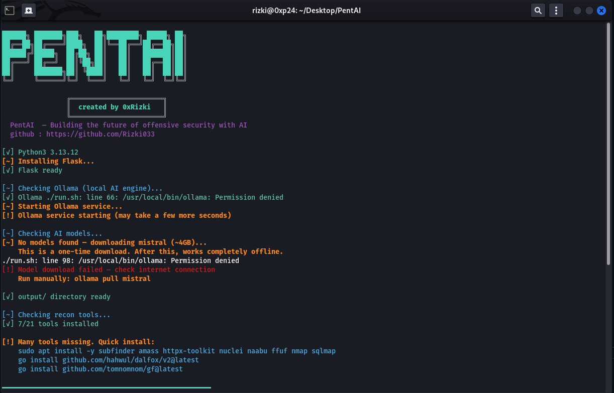
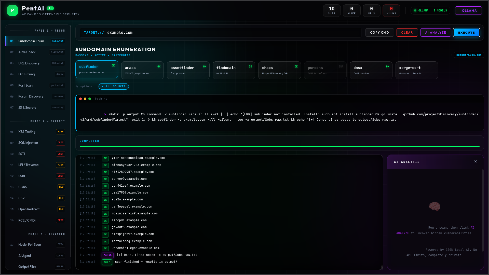
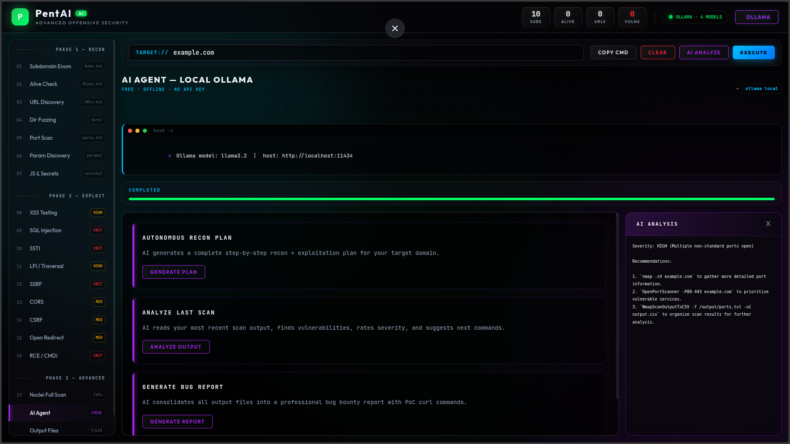
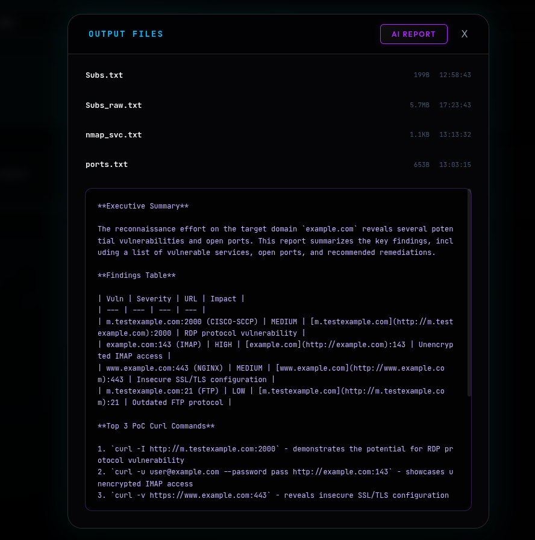
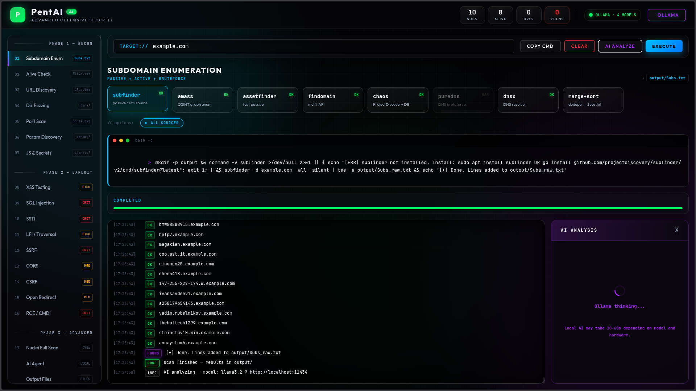
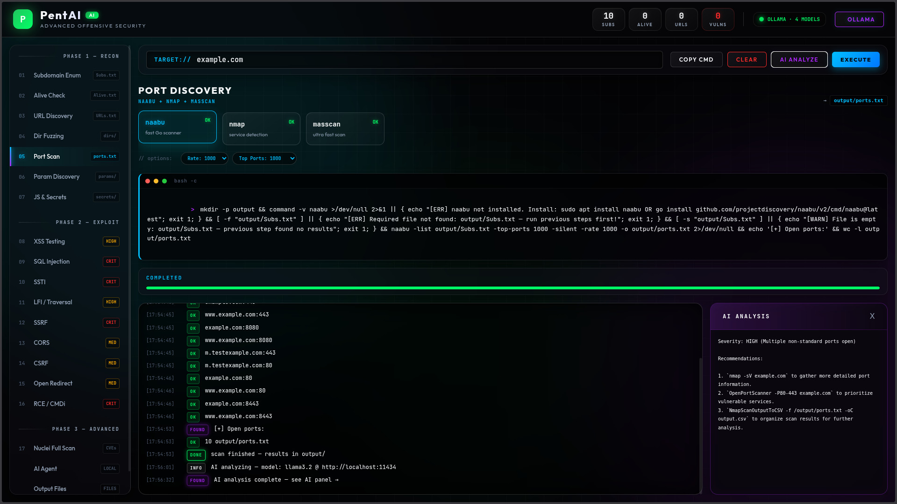

# PentAI
## Building the future of offensive security with AI 🇲🇦

PentAI is an AI-powered security automation platform for reconnaissance, vulnerability discovery, pentesting operations, and offensive security workflows. It combines a local Flask dashboard, common security tooling, and Ollama-based AI analysis to help ethical hackers, red teamers, security researchers, and bug bounty hunters work faster.

## Live Website

[Visit the live demo](https://pent-ai-rizki.lovable.app/)

[](https://pent-ai-rizki.lovable.app/)

## Screenshots

### Startup Terminal

PentAI bootstraps the local Flask app, checks tooling, verifies Ollama, and prepares the output workspace.



### Main Dashboard

The main interface is organized around recon, exploitation, AI analysis, and output review from a single command center.



### Local AI Agent

The Ollama-powered AI panel can generate recon plans, analyze the latest scan, and turn findings into a professional report.



### Autonomous Mode

The autonomous workflow view is designed to chain the next logical scan step automatically from the current project state.


### AI Report View

Generated reports are displayed directly in the dashboard so findings, severity, and PoC commands stay close to the raw output files.



### Ollama Workflow

The local AI flow includes a thinking state and a final results state inside the right-hand analysis panel.




---

## Overview

PentAI streamlines the full workflow from target discovery to reporting:

- runs recon and validation commands from a web UI
- streams command output live in the browser
- stores results in the output/ directory
- uses Ollama to analyze findings, suggest next steps, and generate reports
- works fully offline after the first model download

---

## Features

### Recon
- Subdomain enumeration: subfinder, amass, assetfinder, findomain, chaos, puredns, dnsx
- Alive checks: httpx
- URL discovery: gau, waybackurls, katana, hakrawler, gospider, paramspider
- Directory fuzzing: ffuf, feroxbuster, gobuster, dirsearch
- Port scanning: nmap, naabu, masscan
- Parameter discovery: arjun, x8, ffuf-based parameter fuzzing
- JS and secret hunting: trufflehog, gitleaks, bfac

### Vulnerability Testing
- XSS: Cross-Site Scripting
- SQLi: SQL Injection
- LFI / Path Traversal
- SSRF: Server-Side Request Forgery
- SSTI: Server-Side Template Injection
- CORS misconfiguration
- CSRF: Cross-Site Request Forgery
- Open Redirect
- RCE / Command Injection
- Nuclei full scan for CVEs, exposures, and misconfigurations

### AI Agent
- Powered by Ollama
- Analyzes scan output and highlights likely vulnerabilities
- Generates recon plans
- Writes professional security reports
- Runs locally with no API key and no external service dependency

---

## Quick Start

```bash
git clone https://github.com/Rizki033/PentAI.git
cd PentAI
chmod +x run.sh
./run.sh
```

Open: **http://localhost:5000**

---

## Requirements

- Python 3.8+
- Linux
- Bash-compatible shell
- Required security tools installed on PATH
- Ollama for AI features

---

## Install Dependencies

```bash
sudo apt update
sudo apt install -y git python3 python3-pip nmap ffuf gobuster sqlmap
pip3 install flask
```

---

## Install Recon Tools

```bash
# ProjectDiscovery tools
sudo apt install -y subfinder httpx-toolkit nuclei naabu katana dnsx

# Go tools
go install github.com/tomnomnom/assetfinder@latest
go install github.com/tomnomnom/waybackurls@latest
go install github.com/tomnomnom/gf@latest
go install github.com/tomnomnom/qsreplace@latest
go install github.com/tomnomnom/anew@latest
go install github.com/lc/gau/v2/cmd/gau@latest
go install github.com/hakluke/hakrawler@latest
go install github.com/hahwul/dalfox/v2@latest
go install github.com/s0md3v/uro@latest

# Wordlists
sudo apt install -y seclists
```

---

## Install AI Agent

```bash
# Install Ollama
curl -fsSL https://ollama.com/install.sh | sh

# Pull a model
ollama pull mistral
```

---

## How It Works

1. Subdomain enumeration → output/Subs.txt
2. Alive checks → output/Alive.txt
3. URL discovery → output/URLs.txt
4. Directory fuzzing and port scanning → output/dirs_all.txt, output/ports.txt
5. Parameter discovery and secret hunting → output/params_found.txt and related files
6. Vulnerability testing → output/xss_vulns.txt, output/sqli_results.txt, and more
7. Nuclei scan → output/nuclei_all.txt
8. AI analysis and report generation → local Ollama response

---

## Output Structure

```
output/
├── Subs_raw.txt        # All subdomains
├── Subs.txt            # Unique subdomains
├── Alive.txt           # Live hosts
├── Alive200.txt        # 200-OK hosts only
├── URLs_raw.txt        # All discovered URLs
├── URLs.txt            # Unique filtered URLs
├── ports.txt           # Open ports
├── params_found.txt    # Discovered parameters
├── xss_vulns.txt       # Confirmed XSS
├── sqli_results.txt    # SQLi findings
├── nuclei_all.txt      # Nuclei findings
└── ...
```

---

## Web Dashboard

The interface includes:

- target input and command preview
- live execution output
- AI analysis panel
- output browser
- Ollama model selection and testing
- scan statistics counters

### Interface Preview


---

## API Endpoints

- / — main dashboard
- /api/tools — installed tool check
- /api/models — available Ollama models
- /api/command — build command only
- /api/run — execute a scan and stream output
- /api/agent/analyze — analyze the latest scan output
- /api/agent/plan — generate a recon plan
- /api/agent/report — generate a report
- /api/outputs — list generated files
- /api/read/<filename> — read an output file
- /api/stats — current result counters

---

## Ethical Use

PentAI is intended only for authorized testing, research, and educational use. Use it only on systems you are permitted to assess.
